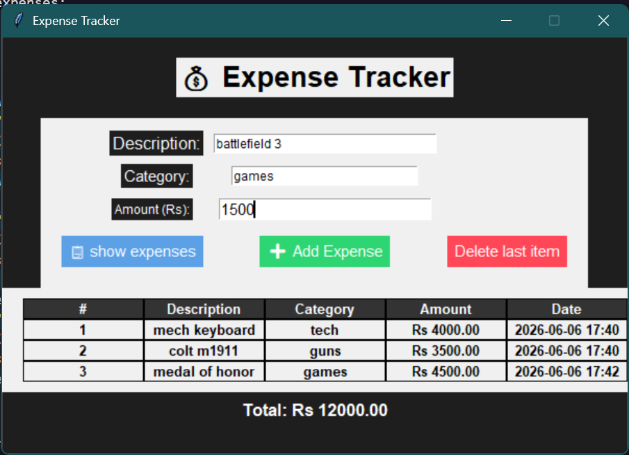

# 💰 Desktop Expense Tracker Application



A lightweight, local desktop application built using **Python** and **Tkinter** to log, monitor, and manage daily financial expenses seamlessly. The application features a relational grid layout and utilizes persistent JSON storage.

## 🚀 Features
* **Persistent Data Storage:** Automatically saves and loads your records from a local `expense_tracker.json` file using Python's `pathlib`.
* **Dynamic Calculations:** Auto-calculates and updates the total dynamic expenditure in real-time.
* **Inline Relational Grid Table:** Completely flushes old widget memory and re-renders safe rows using Tkinter's `.grid_forget()` mechanism to prevent visual overlaps.
* **Input Clean Up:** Automatic structural data validation and instantaneous fields reset upon adding a transaction.

## 🛠️ Built With
* **Python 3.x**
* **Tkinter** (Standard GUI Library)
* **JSON Decoder & Encoder** (Local File Database)

## 📋 How to Run

1. Clone or download this project repository directory to your local machine.
2. Ensure you have Python installed. Run the script directly from your terminal:

```bash
python gui_expense_tracker.py
```

## ⚙️ Application Architecture Breakdown
* **`load()`**: Inspects data safety using `file.stat().st_size` checks to safely circumvent empty JSON parsing crashes.
* **`refresh_table()`**: Sequentially loops via `enumerate()` across data collections to map out exact geometric matrix positioning while maintaining clean button row spans.
