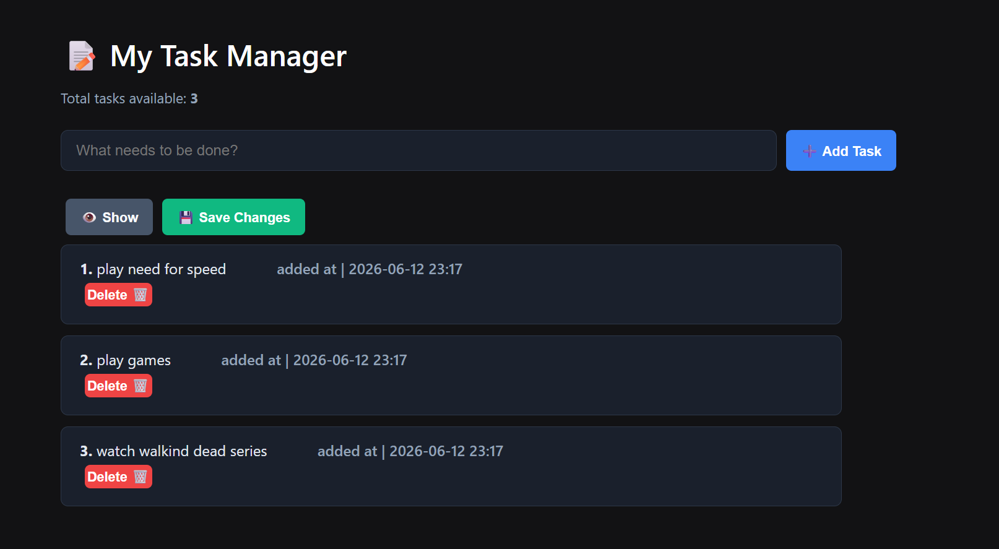

# 📝 Flask Task Manager

A clean, light-weight, and responsive **Task Manager Web Application** built using **Flask (Python)**, dynamic **Jinja templating**, and raw **HTML5/CSS3**. This project features real-time data persistence using a local JSON file.

## ✨ Features
- ➕ **Add Tasks:** Instantly add new tasks with an automated local timestamp.
- 👁️ **Toggle View:** Tasks remain completely hidden until you explicitly click the **Show Tasks** button.
- 💾 **Data Persistence:** Built-in read/write mechanism with a local `details.json` file.
- 🗑️ **Delete Tasks:** Remove individual tasks seamlessly via list indices.
- 📱 **Clean Dark UI:** Fully customized layout styled without heavy neon, ensuring screen comfort.

## 🖥️ Application Preview




## 📁 Project Structure
```text
Project10_flask/
│
├── app.py              # Main Flask application logic
├── details.json        # JSON file serving as the local database
├── .gitignore          # Restricts unnecessary environment/cache files from Git
├── README.md           # Project documentation
└── templates/
    └── index.html      # Frontend layout with HTML, CSS, and Jinja
```

## 🚀 How to Run Locally

### 1. Clone the repository
```bash
git clone https://github.com
cd Project10_flask
```

### 2. Set up and Activate Virtual Environment
```bash
# Windows
python -m venv .venv
.venv\Scripts\activate

# macOS/Linux
python3 -m venv .venv
source .venv/bin/activate
```

### 3. Run the Flask Application
```bash
python app.py
```
Open your browser and visit: `http://127.0.0`

## 🛠️ Tech Stack Used
- **Backend:** Python (Flask Microframework)
- **Frontend:** HTML5, CSS3 (Custom Flexbox layout)
- **Database:** Local JSON File I/O (`json` module)
